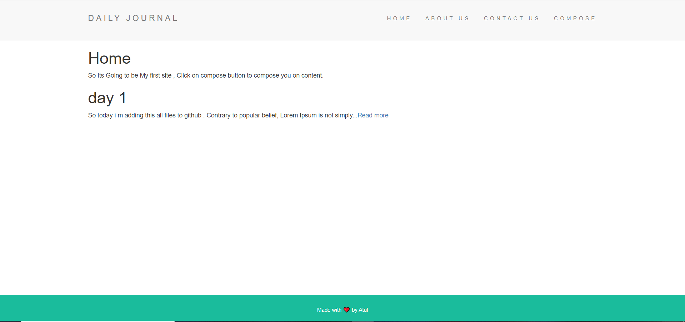
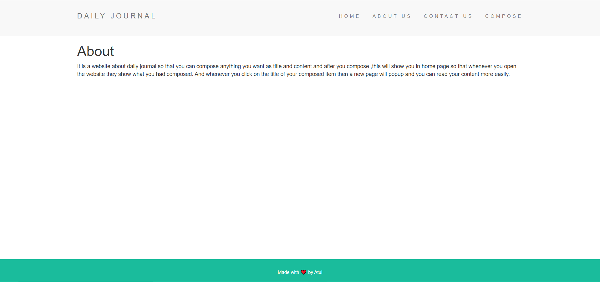
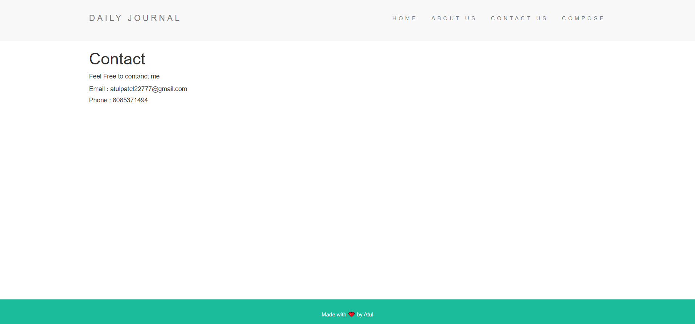
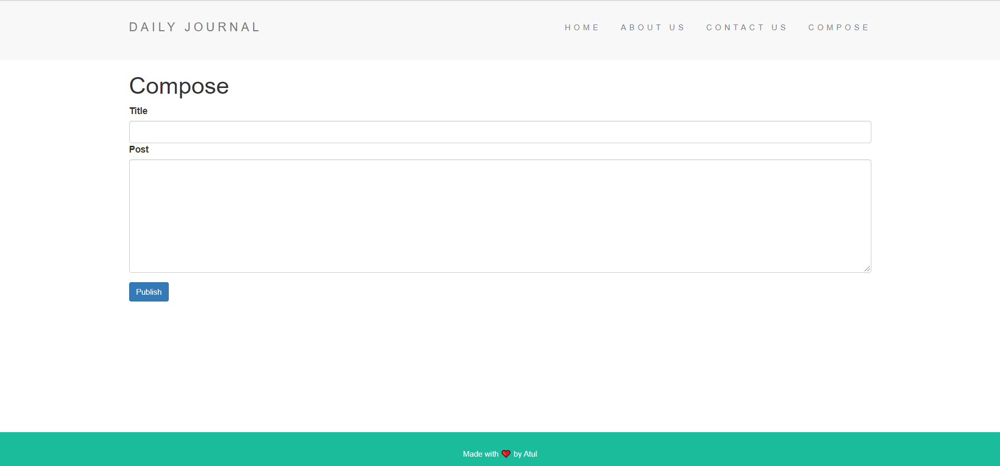

Live site -- https://boiling-fortress-52631.herokuapp.com/

# Blog-Channel
Build a blog channel where you can compose your blogs easily using Express , Node and EJS . Used EJS Templates , EJS Partials for the same HTML across multiple views and also used Data Persistence using databases and mongoDB and Mongoose.

